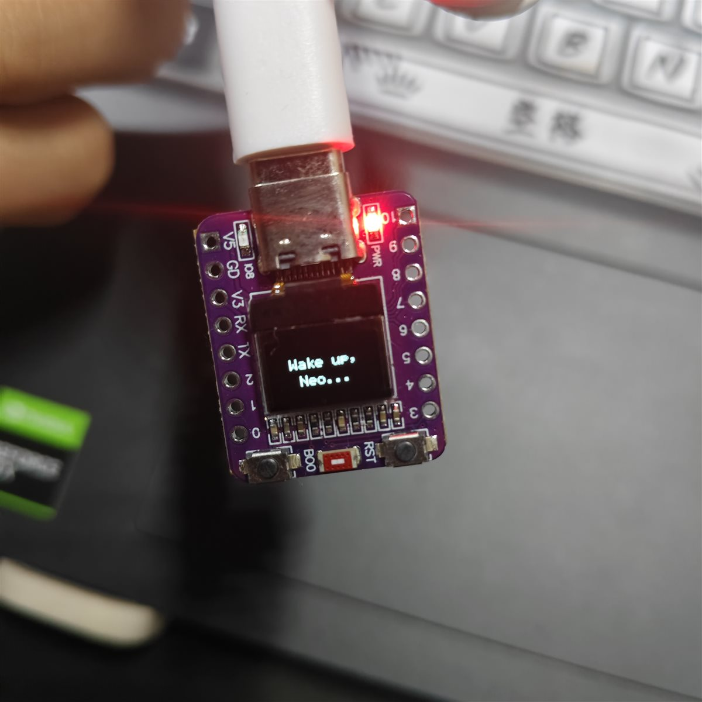

# Digital Rain Ring · 黑客帝国"代码雨"戒指

English | [中文](#中文说明)

A Matrix-style **"digital rain"** running on an ESP32-C3 and a tiny 0.42-inch OLED —
inspired by Daniel Idle's *Digital Rain Ring*.

<!-- TODO: 拍一段效果视频/照片放进 docs/ 目录后，取消下面这行的注释

-->

## What it does

1. **Code rain** — 10 columns of katakana glyphs falling down the screen,
   just like the classic scene from *The Matrix*.
2. **Easter egg** — on boot, the screen types out `Wake up, Neo...`
   letter by letter like an old terminal; the rain pauses and replays
   the typing every ~20 seconds.

## Hardware

| Item | Detail |
|------|--------|
| MCU | ESP32-C3 dev board |
| Display | 0.42" OLED, SSD1306 driver, 72x40 visible pixels, I2C |
| Connection | I2C (auto-detected pins/address, no code change needed) |

The program probes common I2C pin pairs and addresses at boot.
On this board it resolves to **SDA=GPIO5, SCL=GPIO6, address=0x3C**.

## Build & Flash

Requires [ESP-IDF](https://docs.espressif.com/projects/esp-idf/) v5.5.

```bash
idf.py set-target esp32c3     # first time only
idf.py build flash monitor
```

## Tuning

All the fun knobs are at the top of [main/main.c](main/main.c):

| Macro | Default | Meaning |
|-------|---------|---------|
| `RAIN_FPS` | 15 | Animation frame rate |
| `NCOLS` / `COL_PITCH` | 10 / 6 | Number of rain columns / spacing |
| `EGG_PERIOD_FRAMES` | 225 | Frames between easter eggs (~20 s) |
| `EGG_TYPE_FRAMES` | 2 | Frames per typed character (smaller = faster) |

---

## 中文说明

在 ESP32-C3 和 0.42 寸小 OLED 上复刻《黑客帝国》的**代码雨**，
灵感来自英国设计师 Daniel Idle 的 *Digital Rain Ring*（数字雨戒指）。

### 效果

1. **代码雨**：10 列片假名字符不断从屏幕顶部落下，尾迹长短、下落速度随机错落。
2. **彩蛋**：开机像老式终端一样逐字打出 `Wake up, Neo...`，
   之后每隔约 20 秒暂停下雨、重打一遍，然后雨滴从原地继续下。

### 硬件

- ESP32-C3 开发板
- 0.42 寸 OLED（SSD1306 驱动，72x40 像素，I2C 接口）
- 程序自动探测 I2C 引脚和地址（本板实测：SDA=GPIO5，SCL=GPIO6，地址 0x3C）

### 编译烧录

需要 [ESP-IDF](https://docs.espressif.com/projects/esp-idf/) v5.5：

```bash
idf.py set-target esp32c3     # 首次编译前指定芯片
idf.py build flash monitor
```

### 实现要点

- 全部画面先画在一块显存镜像 `vfb[8][128]` 里，再整帧刷到屏幕（15 FPS，无闪烁）
- 37 个手工设计的 5x7 片假名字形放在 `kata[]` 字库表，雨滴状态机只存字形下标
- 每列雨滴独立：随机速度（1~3 帧/行）、随机尾迹长度（2~4 行）、随机重生等待
- 这块屏的两个坑：显存与屏幕方向"横竖互换"；玻璃边缘有一排连着显存页 5~7
  的隐形像素，程序始终把这几页保持全黑来压住杂点（详见 `main.c` 文件头注释）

### 致谢

- [Daniel Idle — Digital Rain Ring](https://danielidle.co.uk/) 原始设计灵感
- 《The Matrix》(1999)

## License

TBD
